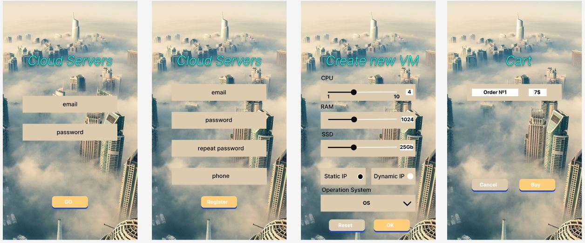

# Homework
Архитектура ПО (семинары)
Урок 9. Способы организации передачи данных между компонентами приложения, протоколы и API. REST, gRPC, очереди

Разработать экранные формы интерфейса для заказа ресурсов в облачном сервисе в https://www.figma.com/ или https://app.diagrams.net/.

Разработать полную ERD домена в https://www.dbdesigner.net/.

Дополнить swagger ответами домена (сутевые ответы) о статусе заказа ресурсов (создан, ошибка, нет ответа) и смоделировать ошибки REST «400, 500» типов.
Имплементировать сгенерированный swagger код в приложения студента.

